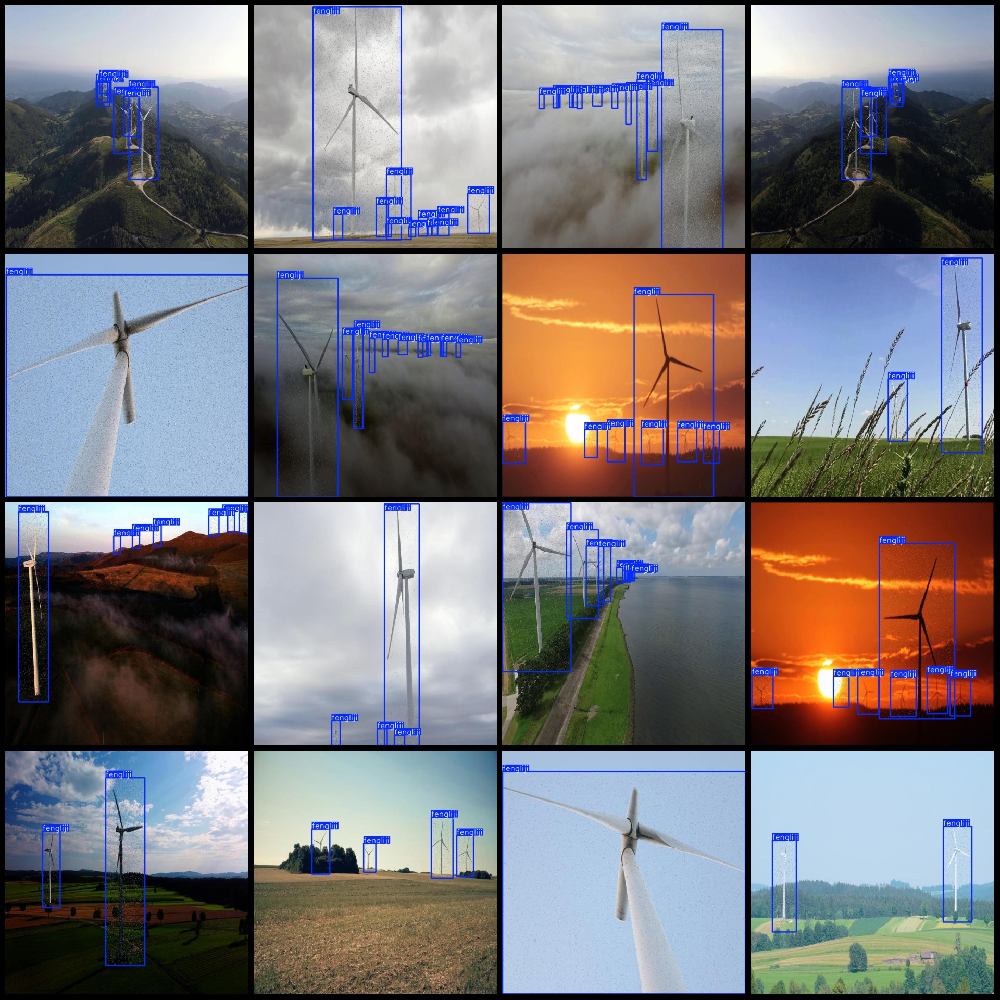
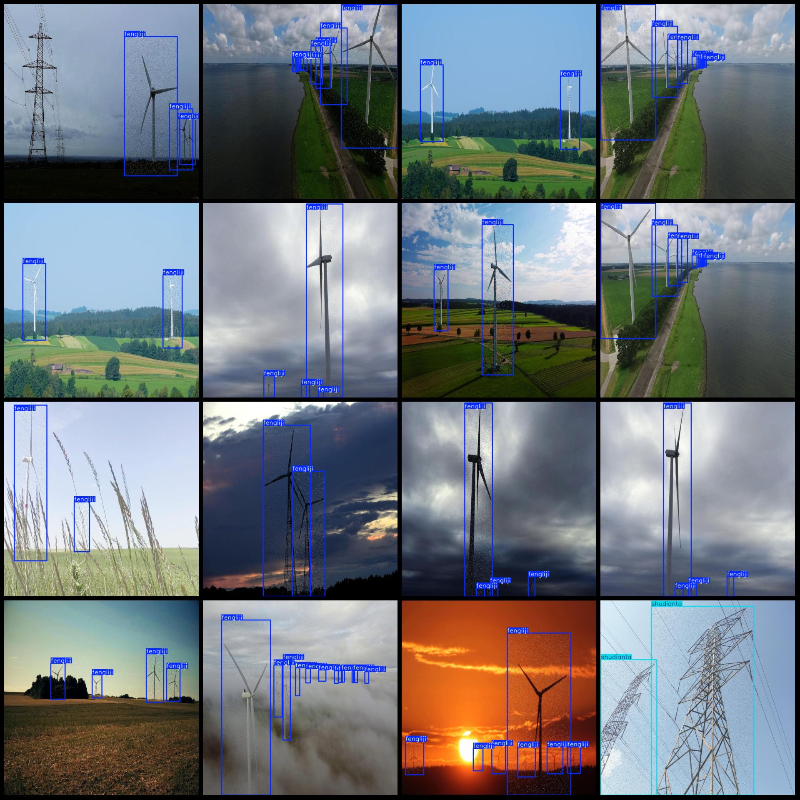

# Wind Turbine and Transmission Tower Detection Dataset VOC+YOLO in Pascal VOC format + YOLO format (without split path txt files, only including JPG images and corresponding VOC format xml files and 
YOLO format txt files)

Please note that approximately half of the dataset contains enhanced images with contrast and brightness enhancements.

Dataset format: Pascal VOC format + YOLO format (excluding split path txt files, only including JPG images and corresponding VOC format xml files and YOLO format txt files).

Number of images (JPG file count): 2968
Number of annotations (XML file count): 2968
Number of annotations (TXT file count): 2968
Number of annotation categories: 2
Annotation category names (Note that the order in YOLO format is not consistent with this, but is based on the labels folder "classes.txt"): ["fengliji", "shudianta"]
Box numbers for each category:
- Fengliji (wind turbine) box numbers = 17392
- Shudiantan (transmission tower) box numbers = 491
Total boxes: 17883
Box numbers per image for each category:
- Fengliji occupied images = 2835
- Shudiantan occupied images = 133

Image resolution: 640x640

Annotation tools used: labelImg
Annotation rules: draw a rectangle around the category

Special notice: The dataset does not include a training/validation/test split; users are required to manually divide it.

Special declaration: This dataset does not guarantee the accuracy of models trained on it or the weight files.

Image previews:
Annotation example:

## Images

Here is a pay link on Stripe ( https://buy.stripe.com/3cs8yP7sY87d0vu9AB ). Please contact me lonlonago@foxmail.com after funding $89, and I will send you a complete data files , thank you!

